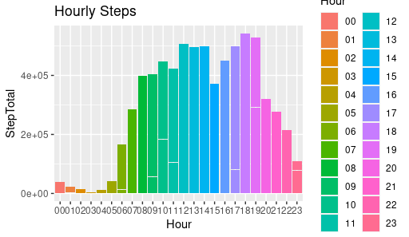

```{r setup, include=FALSE}
knitr::opts_chunk$set(echo = TRUE)
```

## Introduction
  In this case study, I will perform many real-world tasks of a junior data analyst. In this case study, I am working for an imaginary company Bellabeat, a high-tech manufacturer of health-focused products for women. In order to answer the key business questions, I will follow the steps of the data analysis process: Ask, Prepare, Process, Analyze, Share, and Act. 

## Scenario
  Since it was founded in 2013, Bellabeat has grown rapidly and quickly positioned itself as a tech-driven wellness company for women. The company has 5 focus products: bellabeat app, leaf, time, spring and bellabeat membership. Bellabeat is a successful small company, but they have the potential to become a larger player in the global smart device market. Our team has been asked to analyze smart device data to gain insight into how consumers are using their smart devices. The insights we discover will then help guide marketing strategy for the company.
  
## Ask
### Business Task
  Analyze Fitbit data to gain insight and help guide marketing strategy for Bellabeat to grow as a global player.
  
### Questions to ask
  1. What are some trends in smart device usage?
  2. How could these trends apply to Bellabeat customers?
  3. How could these trends help influence Bellabeat marketing strategy?
  
## Prepare
  Source of data: A public dataset downloaded from: https://www.kaggle.com/datasets/arashnic/fitbit/code?resource=download
  
  
Sršen, Bellabeat’s cofounder and Chief Creative Officer, encouraged us to use public data that explores smart device users’ daily habits. This Kaggle data set contains personal fitness tracker from thirty fitbit users. Thirty eligible Fitbit users consented to the submission of personal tracker data, including minute-level output for physical activity, heart rate, and sleep monitoring. It includes information
about daily activity, steps, and heart rate that can be used to explore users’ habits. Sršen tells us that this data set might
have some limitations, and encourages us to consider adding another data to help address those limitations as you begin
to work more with this data.

## Process
  Clean and format data to be more meaningful and clearer. In this step I have organized data by adding columns, extracting information and removing bad data and duplicates.


```
dim(sleepDay_merged)
sum(is.na(sleepDay_merged))
sum(duplicated(sleepDay_merged))
sleep_day <- sleepDay_merged[!duplicated(sleepDay_merged), ]
```

Convert ActivityDate into date format and add a column for day of the week:
```
daily_activity <- dailyActivity_merged %>% mutate( Weekday = weekdays(as.Date(ActivityDate, "%m/%d/%Y")))
```

Check to see if we have 30 users using ```n_distinct()```. The dataset has 33 user data from daily activity, 24 from sleep and only 8 from weight. If there is a discrepency such as in the weight table, check to see how the data are recorded. The way the user record the data may give you insight on why there is missing data. 
```
weightLogInfo_merged %>% 
  filter(IsManualReport == "True") %>% 
  group_by(Id) %>% 
  summarise("Manual Weight Report"=n()) %>%
  distinct()
weight_log <- weightLogInfo_merged   
  
 ```
 Checking for NA in datasets
 
 ```
 sum(is.na(daily_activity))
sum(is.na(sleep_day))
sum(is.na(weight_log))

sum(duplicated(daily_activity))
sum(duplicated(sleep_day))
sum(duplicated(weight_log))
```

Removing duplicates

```
sleep_day <- sleep_day[!duplicated(sleep_day), ]
sum(duplicated(sleep_day))
```

Adding new column for weekdays
```
daily_activity <- daily_activity %>% mutate( Weekday = weekdays(as.Date(ActivityDate, "%m/%d/%Y")))
```

Merging daily_activity, sleep_day and weight_log by id

```
merged1 <- merge(daily_activity,sleep_day,by = c("Id"), all=TRUE)
merged_data <- merge(merged1, weight_log, by = c("Id"), all=TRUE)
```
 
 Additional insight to be awared of is how often user record their data. We can see from the ```ggplot()``` bar graph that the data are greatest from Tuesday to Thursday. We need to investigate the data recording distribution. Monday and Friday are both weekdays, why isn't the data recordings as much as the other weekdays? 
```
ggplot(data=merged_data, aes(x=Weekday))+
  geom_bar(fill="steelblue")
```
### Data recorded during the week


 From weekday's total asleep minutes, we can see the graph look almost **same** as the graph above! We can confirmed that most sleep data is also recorded during Tuesday to Thursday. This raised a question "how comprehensive are the data to form an accurate analysis?"
 
```
ggplot(data=merged_data, aes(x=Weekday, y=TotalMinutesAsleep, fill=Weekday))+ 
  geom_bar(stat="identity", fill="steelblue")+
  labs(title="Total Minutes Asleep During the Week", y="Total Minutes Asleep")
  
```


## Analyze and Share
 Check min, max, mean, median and any outliers. Avg weight is 135 pounds with BMI of 24 and burn 2050 calories. Avg steps is 10200, max is almost triple that 36000 steps. Users spend on avg 12 hours a day in sedentary minutes, 4 hours lightly active, only half hour in fairly+very active! Users also gets about 7 hour of sleep. 

```
merged_data %>%
  dplyr::select(Weekday,
         TotalSteps,
         TotalDistance,
         VeryActiveMinutes,
         FairlyActiveMinutes,
         LightlyActiveMinutes,
         SedentaryMinutes,
         Calories,
         TotalMinutesAsleep,
         TotalTimeInBed,
         WeightPounds,
         BMI
         ) %>%
  summary()
```

### Active minutes:
  Percentage of active minutes in the four categories: very active, fairly active, lightly active and sedentary. From the pie chart, we can see that most users spent 81.3% of their daily activity in sedentary minutes and only 1.74% in very active minutes. 
  
```  
active_users <- daily_activity %>%
  filter(FairlyActiveMinutes >= 21.4 | VeryActiveMinutes>=10.7) %>% 
  group_by(Id) %>% 
  count(Id) 

total_minutes <- sum(daily_activity$SedentaryMinutes, daily_activity$VeryActiveMinutes, daily_activity$FairlyActiveMinutes, daily_activity$LightlyActiveMinutes)
sedentary_percentage <- sum(daily_activity$SedentaryMinutes)/total_minutes*100
lightly_percentage <- sum(daily_activity$LightlyActiveMinutes)/total_minutes*100
fairly_percentage <- sum(daily_activity$FairlyActiveMinutes)/total_minutes*100
active_percentage <- sum(daily_activity$VeryActiveMinutes)/total_minutes*100

#Pie charts
percentage <- data.frame(
  level=c("Sedentary", "Lightly", "Fairly", "Very Active"),
  minutes=c(sedentary_percentage,lightly_percentage,fairly_percentage,active_percentage)
)


plot_ly(percentage, labels = ~level, values = ~minutes, type = 'pie',textposition = 'outside',textinfo = 'label+percent') %>%
  layout(title = 'Activity Level Minutes',
         xaxis = list(showgrid = FALSE, zeroline = FALSE, showticklabels = FALSE),
         yaxis = list(showgrid = FALSE, zeroline = FALSE, showticklabels = FALSE))

cklabels = FALSE))
```


The American Heart Association and World Health Organization recommend at least 150 minutes of moderate-intensity activity or 75 minutes of vigorous activity, or a combination of both, each week. That means it needs an daily goal of 21.4 minutes of FairlyActiveMinutes or 10.7 minutes of VeryActiveMinutes.

In our dataset, **30 users** met fairly active minutes or very active minutes.
```
active_users <- daily_activity %>%
  filter(FairlyActiveMinutes >= 21.4 | VeryActiveMinutes>=10.7) %>% 
  group_by(Id) %>% 
  count(Id) 
```

### Noticeable Day:


The bar graph shows that there is a jump on Saturday: user spent LESS time in sedentary minutes and take MORE steps. Users are out and about on Saturday.
```
ggplot(data=daily_activity, aes(x=Weekday, y=SedentaryMinutes, fill=Weekday))+ 
  geom_bar(stat="identity", fill="steelblue")+
  labs(title="Less Sedentary minutes on Saturday")

  ```


```
ggplot(data=daily_activity, aes(x=Weekday, y=TotalSteps, fill=Weekday))+ 
  geom_bar(stat="identity", fill="steelblue")+
  labs(title="More steps on Saturday")

  ```
  

### Total Steps:


Let's look at how active the users are per hourly in total steps. From 5PM to 7PM the users take the most steps. 
```
hourly_step <- hourlySteps_merged
head(hourly_step)
n_distinct(hourly_step$Id) #33 users

hourly_step$ActivityHour=as.POSIXct(hourly_step$ActivityHour,format="%m/%d/%Y %I:%M:%S %p")
hourly_step$Hour <-  format(hourly_step$ActivityHour,format= "%H")
head(hourly_step)

ggplot(data=hourly_step, aes(x=Hour, y=StepTotal, fill=Hour))+
  geom_bar(stat="identity")+
  labs(title="Hourly Steps")


```


### Findings:


The more active that you're, the more steps you take, and the more calories you will burn. This is an obvious fact, but we can still look into the data to find any interesting. Here we see that some users who are sedentary, take minimal steps, but still able to burn over 1500 to 2500 calories compare to users who are more active, take more steps, but still burn similar calories.


```
ggplot(data=daily_activity, aes(x=TotalSteps, y = Calories, color=SedentaryMinutes))+ 
  geom_point()+ 
  stat_smooth(method=lm)+
  scale_color_gradient(low="steelblue", high="orange")

```


Users who take more steps, burn more calories and has lower BMI. We also see some outliers in the top left corner.  


```
ggplot(data=merged_data, aes(x=TotalSteps, y = BMI, color=Calories))+ 
  geom_point()+ 
  stat_smooth(method=lm)+
   scale_color_gradient(low="blue", high="yellow")
   
```   


### Sleep:


According to article: [Fitbit Sleep Study](https://blog.fitbit.com/sleep-study/#:~:text=The%20average%20Fitbit%20user%20is,is%20spent%20restless%20or%20awake.&text=People%20who%20sleep%205%20hours,the%20beginning%20of%20the%20night.), 55 minutes are spent awake in bed before going to sleep. We have 13 users in our dataset spend 55 minutes awake before alseep. 


```
awake_in_bed <- mutate(sleep_day, AwakeTime = TotalTimeInBed - TotalMinutesAsleep)
awake_in_bed <- awake_in_bed %>% 
  filter(AwakeTime >= 55) %>% 
  group_by(Id) %>% 
  arrange(AwakeTime) 
```

We can use regression analysis look at the variables and correlation. For R-squared, 0% indicates that the model explains none of the variability of the response data around its mean. Higher % indicates that the model explains more of the variability of the response data around its mean. Postive slope means variables increase/decrease with each other, and negative means one variable go up and the other go down. We want to look at if users who spend more time in sedentary minutes spend more time sleeping as well. We can use regression analysis ```lm()``` to check for the dependent and indepedent variables. We also find that how many minutes an user asleep have an very weak correlation with how long they spend in sedentary minutes during the day.  
```
sedentary_vs_sleep.mod <- lm(SedentaryMinutes ~ TotalMinutesAsleep, data = merged_data)
summary(sedentary_vs_sleep.mod)
```

How about calories vs asleep? Do people sleep more burn less calories? Plotting the two variables we can see that there is not much a correlation. 
```
ggplot(data=merged_data, aes(x=TotalMinutesAsleep, y = Calories, color=TotalMinutesAsleep))+ 
  geom_point()+ 
  labs(title="Total Minutes Asleep vs Calories")+
  xlab("Total Minutes Alseep")+
  stat_smooth(method=lm)+
  scale_color_gradient(low="orange", high="steelblue")
```


## Act
After performing the collection, transformation, cleaning, organisation and analysis of the given datasets, we have enough factual evidence to suggest answers to the business-related questions that were asked.

We can infer that the duration and the level of intensity of the activities performed are greatly in dependence to the amount of calories burned. METs provide a great insight on the intensity of activities performed and the amount of calories burned per minute. While most of the consumers attain adequate amounts of sleep, it is noticed that a small fraction of the users either oversleep or undersleep. Consumers are also more likely to perform low-high intensity activities in the range of 7:00 AM - 8:00PM throughout the day.

In order to design new marketing strategies to better focus on unlocking new growth opportunities and develop the business, we have to refer to the analysis provided above and keep those facts in mind. The recommendations I would provide to help solve this business-related scenario is shown below.

Some recommendations to Marketing strategists:

1) Highlight the MET tracking feature on the smart devices as a marketing strategy and create awareness on MET values. For it allows users to track their level of intensity of activities and provide a real time insight on how much calories they burn every minute.
2) Consumers seem to spend most of their time inactive and live a sedentary lifestyle. Notifying users through smart device notifications during the most popular time for performing activities which is between 7:00 AM - 8:00PM can remind people to exercise and live a more active lifestyle.
3) Provide app notification for users to remind them to get sufficient sleep every day and implement new sleep measurement features or products such as tracking Rapid Eye Movement (REM) sleep.
4) Consider setting daily/weekly calorie challenges and award points to users based on the top performers. Where the points can be accumulated and redeemed as a discount for their next product purchase.

  


